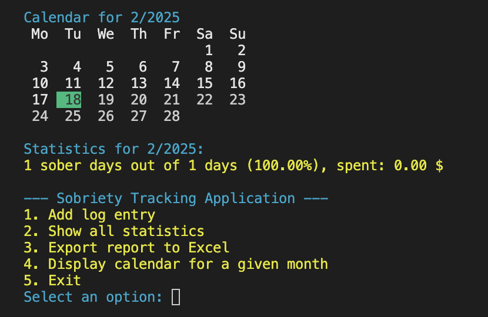
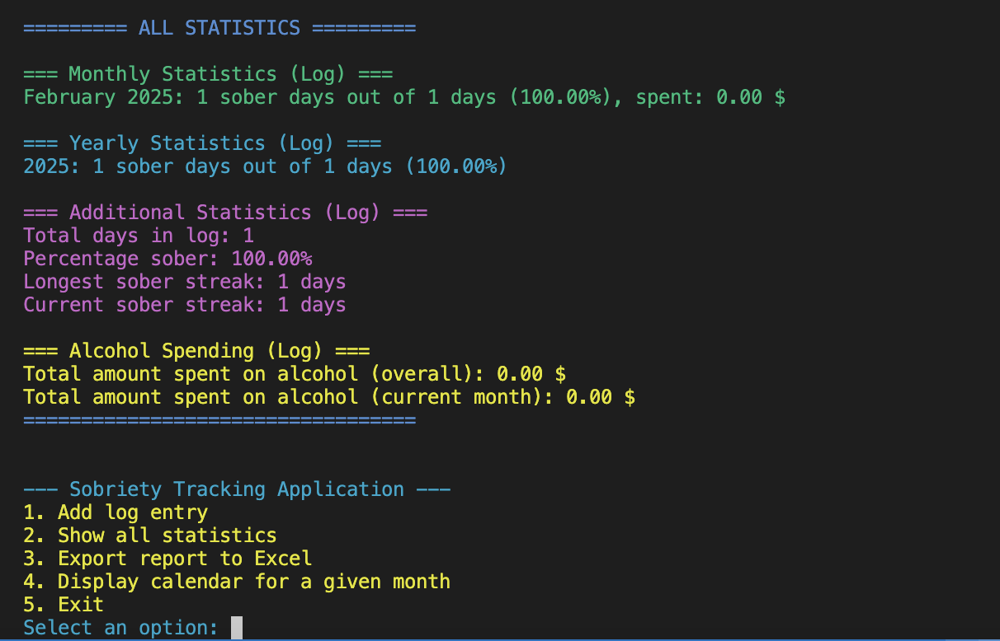

# Sobriety Tracking Application

**Note:** This application was developed by Łukasz Krause with the assistance of ChatGPT using dozens of prompts—from creating the database to adding new functions, refactoring, and implementing improvements—all within one day.

This repository contains a console-based sobriety tracking application written in Python. The application allows you to:

- **Log daily entries** – Record whether you consumed alcohol on a given day along with your mood, notes, type and amount of alcohol, and the amount spent.
- **Display statistics** – View monthly and yearly statistics, including total sober days, drinking days, and spending.
- **Display a formatted calendar** – On startup, the current month’s calendar is shown with days color-coded (green for sober, red for drinking). You can also display the calendar for any given month along with corresponding statistics.
- **Export a report to Excel** – Generate an Excel report (`report <Month> <Year>.xlsx`) containing log entries and a summary.




## Requirements

- Python 3.x
- [colorama](https://pypi.org/project/colorama/) – for colored console output
- [openpyxl](https://pypi.org/project/openpyxl/) – for Excel report generation

Install the required libraries using pip:

```bash
pip install colorama openpyxl
